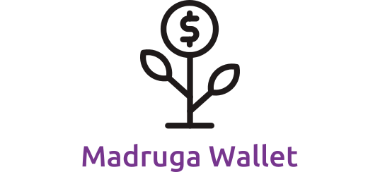

<div align="center">
  
</div>

---

## :memo: Descrição do Projeto

<p align="center">Este é um projeto desenvolvido em React de uma carteira de controle de gastos com conversor de moedas.</p>

## 📋 Tabela de conteúdos

<!--ts-->

- [🎯 Objetivo do projeto](#🎯-objetivo-do-projeto)
- [📝 O que pratiquei](#📝-o-que-pratiquei)
- [🛠 Tecnologias utilizadas](#🛠-tecnologias-utilizadas)
- [🚀 Rodando o projeto na sua máquina](#🚀-rodando-o-projeto-na-sua-máquina)
  - [📍Pre Requisitos](#📍-pre-requisitos)
- [🔜 Implementação futura](#🔜-implementação-futura)
- [👉🏾 Status do projeto](#👉🏾-status-do-projeto)
- [🔗 Link para acessar o projeto](#🔗-link-para-acessar-o-projeto)
- [🤝 Colaboradores](#🤝-colaboradores)

<!--te-->

## 🎯 Objetivo do projeto

Este é um projeto de cunho educativo, no qual pude desenvolver uma aplicação React, simulando uma carteira de despesas, na qual a pessoa usuária consegue:

- Adicionar, remover e editar um gasto;
- Visualizar uma tabela com seus gastos;
- Visualizar o total de gastos convertidos para uma moeda de escolha;

## 📝 O que pratiquei

Neste projeto, foi possível testar as habilidades:

- Criar um store `Redux` em aplicações `React`
- Criar reducers no `Redux` em aplicações `React`
- Criar actions no `Redux` em aplicações `React`
- Criar dispatchers no `Redux` em aplicações `React`
- Conectar `Redux` aos componentes `React`
- Criar actions assíncronas na sua aplicação `React` que faz uso de `Redux`
- Trabalhar com `CSS` e `media-queries`

## 🛠 Tecnologias utilizadas

As seguintes ferramentas foram usadas na construção do projeto:

- [React](https://pt-br.reactjs.org/)
- [styled-components](https://styled-components.com/)
- [Redux](https://redux.js.org/)
- [React Redux](https://react-redux.js.org/)
- [Redux Thunk](https://github.com/reduxjs/redux-thunk)

## 🚀 Rodando o projeto na sua máquina

Para rodar o projeto na sua máquina é necessário alguns pre requisitos:

### 📍Pre Requisitos

Antes de começar, você vai precisar ter instalado em sua máquina as seguintes ferramentas:
[Git](https://git-scm.com), [Node.js](https://nodejs.org/en/).

Além disto é bom ter um editor para trabalhar com o código como [VSCode](https://code.visualstudio.com/)!

Comandos para clonar o projeto na sua máquina:

```bash
# Clone este repositório com o comando:
git clone git@github.com:raphaelprsilva/madruga-wallet.git

# Acesse a pasta do projeto no terminal/cmd com o comando:
cd nome-do-projeto

# Instale as dependências com o comando:
npm install

# Inicie a aplicação com o comando:
npm start

```

## 🔜 Implementação futura

- Melhorias de `css`
- Refatoração de código

## 👉🏾 Status do projeto

O projeto se encontra finalizado!

## 🔗 Link para acessar o projeto

Se quiser ao invés de clonar o projeto e rodar localmente, você deseje ver o mesmo online, basta clicar no link abaixo:

<a href="http://www.madruga-wallet.elraphael.com.br/" target="_blank" rel="noopener">Madruga Wallet</a>

## 🤝 Colaboradores

<table>
  <tr>
    <td align="center">
      <a href="http://github.com/raphaelprsilva">
        <br>
        <sub>
          <b>raphaelprsilva</b>
        </sub>
      </a>
    </td>
  </tr>
</table>
